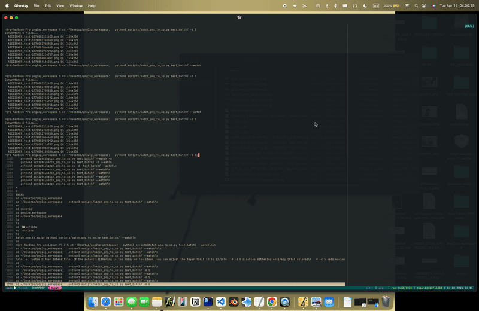

# RexTuul



Zero-dependency PNG <-> REXPaint (.xp) batch converter and TUI viewer.

## Usage

### Convert
```bash
python3 rextuul.py ./dir/          # PNG -> XP [P2X]
python3 rextuul.py ./dir/ -x       # XP -> PNG [X2P]
```

### View
```bash
python3 rextuul.py ./dir/ --watch
```

- **Dithering**: Use `-f` for Floyd-Steinberg or `-d [0-5]` for Bayer.
- **Portability**: Single file, standard library only. No Pillow required.


  4. \Custom Dither Intensity
  If the default dithering is too noisy or too clean, you can adjust the Bayer limit (0 to 5).

   # -d 0 disables dithering entirely (flat colors)
   # -d 5 sets maximum dithering noise
   python3 scripts/batch_png_to_xp.py test_batch/ -d 3

  5. Convert a Single File
  Instead of a whole folder, you can target just one specific asset.

   python3 scripts/batch_png_to_xp.py test_batch/my_image.png

  6. One-Shot Terminal Render
  If you want to convert files and see the result in your scrollback buffer immediately (instead
  of the interactive full-screen --watch mode), use --render.

   python3 scripts/batch_png_to_xp.py test_batch/ --render

  7. Force Specific Width
  By default, it auto-fits to your terminal. Use -W to force a specific character width.

   python3 scripts/batch_png_to_xp.py test_batch/ -W 80
